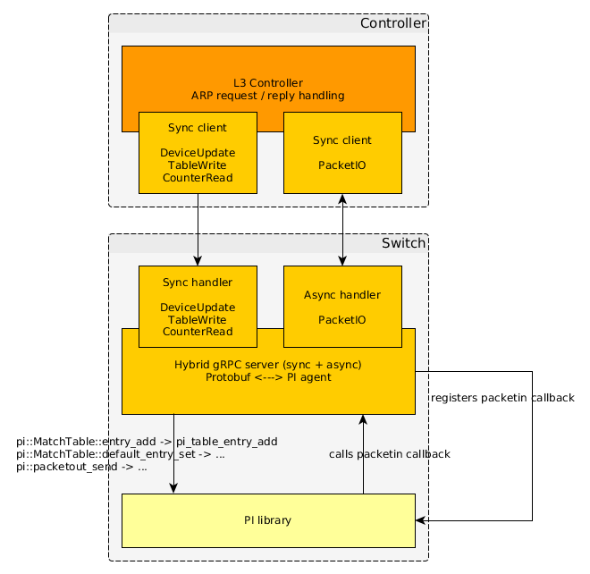

# Controller - Switch demo using Protobuf & gRPC

## Dependencies

- [bmv2] (https://github.com/p4lang/behavioral-model) and all its
  dependencies. We use bmv2 to simulate the P4 dataplane.
- [gRPC] (https://github.com/grpc/grpc)
- the PI libraries (see below)

## Installing the PI

Run the following at the root of this repository:
- `./autogen.sh`
- `./configure --with-bmv2 --with-fe-cpp`
- `make`
- `sudo make install`

## Overview




In this demo, we use gRPC + protobuf as the transport between the controller and
the switch. The gRPC server translates the protobuf messages into PI library
calls (using the PI C++ frontend).

To run the demo, you will need 3 terminal instances:
- `sudo python 1sw_demo.py --json simple_router.json --cpu-port veth250`
- `sudo ./pi_server`
- `sudo ./app -c simple_router.json`

Note that the demo assumes that you have a veth250 / veth251 veth pair on your
machine (used for the switch CPU port). You can create one with:
```
sudo ip link add name veth250 type veth peer name veth251
sudo ip link set dev veth250 up
sudo ip link set dev veth251 up
```

Once the PI server and the app / controller are running, you should be able to
send pings between h1 and h2.

Note that the controller also starts a web server on port 8888. The web page
lets you swap the P4 program (e.g. to simple_router_wcounter.json) and lets you
query a counter.

## Source code description

- [pi.proto] (pi.proto): the proto file which defines the PI gRPC service and
  associated Protobuf messages.
- [pi_server.cpp] (pi_server.cpp): the gRPC server which implements the PI
  service handlers. This code translates the Protobuf messages into PI library
  calls.
- [simple_router_mgr.h] (simple_router_mgr.h) and [simple_router_mgr.cpp]
  (simple_router_mgr.cpp): they define the `SimpleRouterMgr` class, in charge of
  managing one switch instance in the context of the controller.
- [web_server.h] (web_server.h) and [web_server.cpp] (web_server.cpp): they
  define the `WebServer` class, which exposes a web interface into the
  controller.
- [app.cpp] (app.cpp): the controller itself, instantiates `SimpleRouterMgr`
  appropriately and starts the web server.
