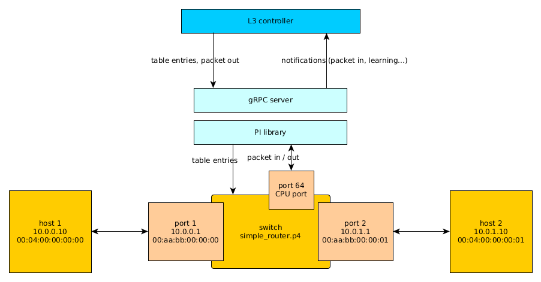
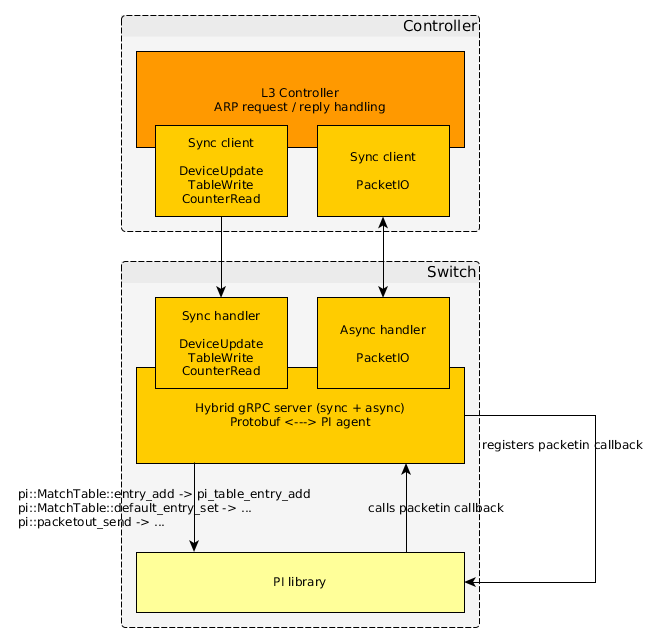

# Controller - Switch demo using Protobuf & gRPC

## Dependencies

- [bmv2](https://github.com/p4lang/behavioral-model) and all its
  dependencies. We use bmv2 to simulate the P4 dataplane.
- [gRPC](https://github.com/grpc/grpc)
- [libmicrohttpd](https://www.gnu.org/software/libmicrohttpd). We use it to
  access some of the controller functions through a web page. In Ubuntu, you can
  install it with ` sudo apt-get install libmicrohttpd-dev`.
- [Boost.Asio](http://www.boost.org/doc/libs/1_62_0/doc/html/boost_asio.html).
  We use it to handle events asynchronously in the controller.

## Building the demo

Right now this demo is integrated in the build of this repository. If you have
the above dependencies, all you need to do is run `./configure --with-proto
--with-bmv2` and it will build the demo code.

## Overview





In this demo, we use gRPC + protobuf as the transport between the controller and
the switch. The gRPC server translates the protobuf messages into PI library
calls (using the PI C++ frontend).

To run the demo, you will need 3 terminal instances:
- `sudo python 1sw_demo.py --cpu-port veth250`
- `sudo ./pi_grpc_server`
- `sudo ./controller -c simple_router.json`

Note that the demo assumes that you have a veth250 / veth251 veth pair on your
machine (used for the switch CPU port). You can create one with:
```
sudo ip link add name veth250 type veth peer name veth251
sudo ip link set dev veth250 up
sudo ip link set dev veth251 up
```

Once the PI server and the app / controller are running, you should be able to
send pings between h1 and h2.

Note that the controller also starts a web server on port 8888. The web page
lets you swap the P4 program (e.g. to simple_router_wcounter.json) and lets you
query a counter.

## Source code description

- [pi_server.cpp](pi_server.cpp): the gRPC server which implements the PI
  service handlers. This code translates the Protobuf messages into calls to the
  PI proto frontend (`DeviceMgr`). This frontend will then call into the PI C
  library.
- [simple_router_mgr.h](simple_router_mgr.h) and
  [simple_router_mgr.cpp](simple_router_mgr.cpp): they define the
  `SimpleRouterMgr` class, in charge of managing one switch instance in the
  context of the controller.
- [web_server.h](web_server.h) and [web_server.cpp](web_server.cpp): they define
  the `WebServer` class, which exposes a web interface into the controller.
- [app.cpp](app.cpp): the controller itself, instantiates `SimpleRouterMgr`
  appropriately and starts the web server.
